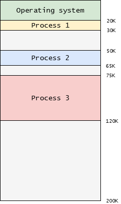

## SISTEMAS OPERATIVOS Y LABORATORIO

## MÓDULO 2: VIRTUALIZACIÓN DE MEMORIA

## BASE & BOUND

1. Dada la configuración de memoria mostrada en la siguiente figura: 

   

   Responda las siguientes preguntas. 
   1. ¿Cuántos espacios de direcciones existen? Justifique su respuesta  
   2. Si se emplean los registros base y bound, cual es el valor para cada uno de los registros asociados a cada uno de los procesos.  
   3. Suponga que llega un nuevo proceso 4 solicitando un bloque de 100K. ¿Es posible acomodar este proceso en la memoria física? Justifique su respuesta usando Dynamic Reallocation.  
   4. Suponga que en cada proceso se accede a la dirección virtual 10K. Determine (en caso de que la dirección sea válida) la correspondiente dirección física asociada para cada caso.

## Paginación

2. Suponga que tiene un pequeño espacio de direcciones virtuales de tamaño 64 KB. Además, suponga que es un sistema que utiliza paginación y que cada página tiene un tamaño de 8 KB.  
   1. ¿Cuántos bits hay en una dirección virtual en este sistema?  
   2. Recuerde que con la paginación, una dirección virtual usualmente se divide en dos componentes: un número de página virtual (VPN) y un desplazamiento (offset). ¿Cuántos bits hay en el VPN  
   3. ¿Cuántos bits hay en el desplazamiento?  
   4. Ahora suponga que el sistema operativo (SO) está utilizando una tabla de páginas lineal, como se discutió en clase. ¿Cuántas entradas contiene esta tabla de páginas lineal?  
      

   **Nota**: No olvide dibujar los formatos de direcciones (fisica y virtual) asi como un bosquejo de las memorias fisica y virtual.

2. Ahora suponga que nuevamente tiene un pequeño espacio de direcciones virtuales de tamaño 64 KB, que el sistema nuevamente utiliza paginación, pero que cada página tiene un tamaño de 4 bytes (nota: ¡no KB\!).  
   1. ¿Cuántos bits hay en una dirección virtual en este sistema?  
   2. ¿Cuántos bits hay en el VPN?  
   3. ¿Cuántos bits hay en el desplazamiento?  
   4. Nuevamente suponga que el SO está utilizando una tabla de páginas lineal. ¿Cuántas entradas contiene esta tabla de páginas lineal?

   **Nota**: No olvide dibujar los formatos de direcciones (fisica y virtual) asi como un bosquejo de las memorias fisica y virtual.

3. Recuerde que el sistema operativo (SO) realiza un seguimiento de la tabla de páginas lineal de un proceso al recordar su dirección base, la cual, para este problema, se asumirá que es la dirección donde se encuentra la tabla de páginas en la memoria física del kernel. Dada la dirección de inicio de la tabla de páginas (**`pt_base`**) y un **`VPN`** que se desea traducir a un **`PFN`** (número de página física), escriba una función que calcule y retorne un puntero a la entrada de la tabla de páginas (**`pte`**) correcta para este **`VPN`**:  
   
  ```c
  struct pte *p find_pte(void *pt_base, int VPN) {   
    struct pte *p = ________ // Escriba aqui el código   return p; 
  } 
  ```

## TLB

1. Asuma un espacio de direcciones virtuales de 32 bits y que la traducción de direcciones se hace mediante paginación de tal manera que la dirección virtual se divide en un número de página virtual (**VPN**) de 20 bits y un desplazamiento (**offset**) de 12 bits.

   Además se tiene una **TLB** de cuatro entradas en la que cada entrada tiene: un VPN (Virtual Page Number) de 20 bits, un PFN (Page Frame Number) de 20 bits y un campo PID (identificador de proceso) de 8 bits. La siguiente tabla muestra el contenido de la TLB asociada (el contenido está en formato hexadecimal):

	| `VPN` | `PFN` | `PID` |
   | :---: | :---: | :---: |
   | `00000` | `00FFF` | `00` |
   | `00000` | `00AAB` | `01` |
   | `00010` | `F000A` | `00` |
   | `010FF` | `00ABC` | `01` |

**Nota**: todos estos números están en hexadecimal. Por lo tanto, cada uno representa cuatro bits (p. ej., el hexadecimal `F` es `1111`, el hexadecimal `A` es `1010`, el hexadecimal `7` es `0111`, y así sucesivamente). Por esta razón, el `VPN` y el `PFN` de 20 bits se representan con cinco números hexadecimales cada uno.

Ahora, para cada una de las siguientes direcciones virtuales, indique si se trata de un acierto de TLB (**TLB hit**) o un fallo de TLB (**TLB miss**). **IMPORTANTE:** Si es un acierto, proporcione la dirección física resultante (en hexadecimal).
   - El PID `00` genera la dirección virtual: `0x00000000`
   - El PID `01` genera la dirección virtual: `0x00000000`  
   - El PID `00` genera la dirección virtual: `0xFF00FFAA`  
   - El PID `00` genera la dirección virtual: `0x0010FFAA`  
   - El PID `01` genera la dirección virtual: `0x0010FFAA`  
   - El PID `00` genera la dirección virtual: `0x000000FF`  
   - El PID `01` genera la dirección virtual: `0x00000FAB`  
   - El PID `00` genera la dirección virtual: `0x010FFFFF`  
   - El PID `01` genera la dirección virtual binaria `00000001000011111111010100001111`  
   - El PID 00 genera la dirección virtual binaria `00000001000011111111010100001111`  
   - El PID `02` genera la dirección virtual: `0x00000000`

## Políticas de reemplazo

1. Suponga que tiene la siguiente secuencia de referencias a páginas: 

   ```
   A, B, C, D, A, B, E, A, B, C, D, E
   ```

   - Asumiendo una caché de páginas de tamaño 3 y una política de reemplazo **FIFO**, ¿cuántos fallos (**misses**) habrá?  
   - Asumiendo una caché de páginas de tamaño 4 y una política de reemplazo **FIFO**, ¿cuántos fallos (**misses**) habrá?  
   - ¿La comparación entre las cachés de 3 y 4 páginas le sorprende de alguna manera? ¿Por qué?  
   - Repita el procedimiento de los primeros dos puntos asumiendo una política **LRU**.  
   - ¿Qué puede observarse al comparar los resultados para la política **LRU** respecto al tamaño de la caché?  
   - Repita el procedimiento de los para los primeros dos puntos asumiendo una política **OPT**.
